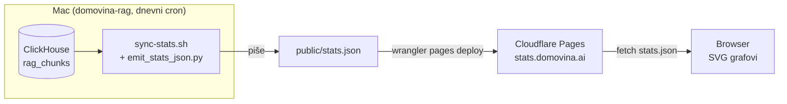

# 01 — Arhitektura

## Ključni princip: statični snapshot, ne live DB

Cloudflare Pages je **statični hosting** — nema backenda. Browser NE smije (i ne
treba) gađati ClickHouse. Statistike se mijenjaju jednom dnevno, pa je snapshot
optimalan.



## Zašto NE Worker + live query

| Live DB (odbačeno) | Statični snapshot (odabrano) |
|---|---|
| Baza izložena internetu | Baza ostaje privatna |
| Treba rate-limiting, cache invalidaciju | Ništa od toga |
| Query može srušiti CH pod prometom | CH se ne dira iz browsera |
| Košta (Worker + egress) | CF Pages besplatan |
| Podaci se ionako mijenjaju 1×/dan | Snapshot točno prati taj ritam |

## Dataflow u kontekstu cijelog sustava

```
producer (fetch.domovina.tv)
    ↓ JSONL + voice embeddings
domovina-rag  (ETL → ClickHouse rag_chunks)
    ↓ dnevni sync-cron.sh (04:00)
    ├─ CH delta push na cloud
    ├─ Meili re-index (derivat)
    ├─ PG speakers / person hub (derivat)
    └─ sync-stats.sh → stats.json → CF Pages   ← OVAJ PROJEKT
domovina-stats (ovaj repo)
    ↓ frontend čita stats.json
stats.domovina.ai  (javni dashboard)
```

`stats.json` je **derivat ClickHouse-a**, isto kao Meili index i PG speakers.
Zato ide u isti dnevni cron i podliježe istom pravilu (svaki CH-derivat → korak u
`sync-cron.sh` + `--cloud`).

## Granice odgovornosti

- **domovina-rag** = generira snapshot (ima CH pristup), deploya (ima CF token).
- **domovina-stats** = crta snapshot. Zna samo za `stats.json` shape (data
  contract, `02-data-contract.md`). Ne zna za ClickHouse, SSH, ni credse.

Ako se zatekneš u ovom repou da pišeš ClickHouse upit ili SSH deploy — **to ide u
domovina-rag**, ne ovdje.
